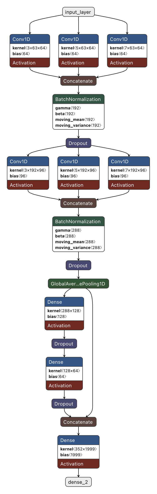

# 🤚 raspberrypi-signlang-ai

라즈베리파이 환경에서 동작하는 AI 기반 수어 인식 프로젝트입니다. 수어 영상에서 랜드마크를 추출하고, 전처리 및 모델 추론을 통해 수어를 인식합니다.

---

## 🔍 개요

수어 동작이 담긴 영상에서 MediaPipe를 활용해 손·몸 랜드마크를 추출하고, 전처리된 특징 데이터를 학습된 모델에 입력하여 수어를 분류합니다. 라즈베리파이에서 실행 가능한 경량 파이프라인을 목표로 개발되었습니다.

---

## 📁 프로젝트 구조

```
raspberrypi-signlang-ai/
├── landmark_extractor/     # 영상에서 랜드마크 추출 (MediaPipe)
├── preprocess/             # 랜드마크 데이터 전처리 및 특징 생성
├── train/                  # 모델 학습 스크립트
├── test/                   # 모델 추론 및 테스트
├── models/                 # 학습된 모델 파일
├── main.py                 # 전체 파이프라인 실행 진입점
└── utils.py                # 로그, 파일 입출력 유틸리티
```

---

## 🛠️ 기술 스택


---

## ✨ 주요 기능

- **랜드마크 추출**: MediaPipe를 활용한 수어 영상의 손·몸 관절 좌표 추출
- **데이터 전처리**: 추출된 랜드마크를 모델 입력에 맞게 정규화 및 특징 생성
- **모델 학습**: 전처리된 특징 데이터를 기반으로 수어 분류 모델 학습
- **수어 인식**: 학습된 모델로 단일 영상에 대한 수어 추론

---

## 🔄 동작 흐름

```
수어 영상 입력
    ↓
landmark_extractor - 랜드마크 추출 (MediaPipe)
    ↓
preprocess - 특징 데이터 전처리
    ↓
test - 모델 추론 및 수어 분류 결과 출력
```

---

## 🏗️ 모델 구조

<!--  -->
<!--  -->
<div>
  
  
</div>

---

## ⚙️ 설치 방법

**1. 저장소 클론**

```bash
git clone https://github.com/wngmlwjd/raspberrypi-signlang-ai.git
cd raspberrypi-signlang-ai
```

**2. 의존 패키지 설치**

```bash
pip install mediapipe opencv-python numpy
```

---

## 🚀 사용 방법

`main.py`에서 테스트할 영상 경로와 모델 날짜를 설정한 후 실행합니다.

```python
# main.py

TEST_VIDEO_PATH = "dataset/processed/single/raw/영상파일명.mp4"
DATE = "20251208_1"  # 사용할 모델 날짜
```

```bash
python main.py
```

실행하면 랜드마크 추출 → 전처리 → 모델 추론 순서로 파이프라인이 자동으로 동작합니다.

---

## 🎥 시연 영상

### 📺 시연 영상 (YouTube)

- [시연 영상 1 - 판박이](https://www.youtube.com/watch?v=1XsR-O8Gaqk)  
- [시연 영상 2 - 막히다](https://www.youtube.com/watch?v=G2--uqK90o0)  
- [시연 영상 3 - 얕보다](https://www.youtube.com/watch?v=OLWex63D95M)

---

## 📌 사용 데이터셋

- [AI Hub - 수어 영상 데이터](https://aihub.or.kr)
